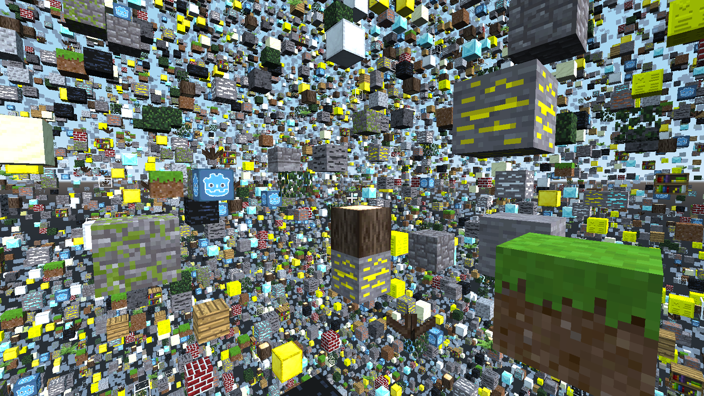
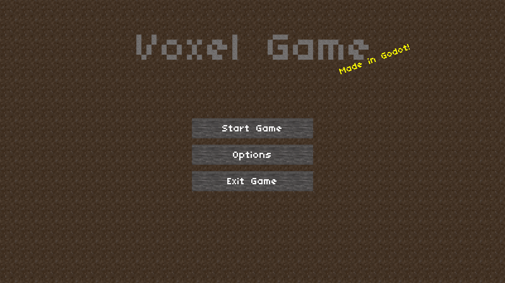

# Voxel Game

This demo is a minimal first-person voxel game,
inspired by others such as Minecraft.

Language: GDScript

Renderer: GLES 3

Check out this demo on the asset library: https://godotengine.org/asset-library/asset/676

## Work In Progress C# Port

Started work on porting the original 3D Voxel Demo from GD script to C#.
Porting a dynamic language to a static is a little messy. 

All GD script classes are fully ported to C# and are wiered up 

There is bug and the voxel boxes are not showing up when game is running.

### Last Playing Commit

commit 87c6921defaf9a10b00e474e6999f259cac16f54
### Goal for Port

Trying to keep the code as close to the GD script version as possible.

Pull requests are welcome.

## How does it work?

Each chunk is a
[`StaticBody`](https://docs.godotengine.org/en/latest/classes/class_staticbody.html)
with each block having its own
[`CollisionShape`](https://docs.godotengine.org/en/latest/classes/class_collisionshape.html)
for collisions. The meshes are created using
[`SurfaceTool`](https://docs.godotengine.org/en/latest/classes/class_surfacetool.html)
which allows specifying vertices, triangles, and UV coordinates
for constructing a mesh.

The chunks and chunk data are stored in
[`Dictionary`](https://docs.godotengine.org/en/latest/classes/class_dictionary.html)
objects. New chunks have their meshes drawn in separate
[`Thread`](https://docs.godotengine.org/en/latest/classes/class_thread.html)s,
but generating the collisions is done in the main thread, since Godot does
not support changing physics objects in a separate thread. There
are two terrain types, random blocks and flat grass. A more
complex terrain generator is out-of-scope for this demo project.

The player can place and break blocks using the
[`RayCast`](https://docs.godotengine.org/en/latest/classes/class_raycast.html)
node attached to the camera. It uses the collision information to
figure out the block position and change the block data. You can
switch the active block using the brackets or with the middle mouse button.

There is a settings menu for render distance and toggling the fog.
Settings are stored inside of an
[AutoLoad singleton](https://docs.godotengine.org/en/latest/getting_started/step_by_step/singletons_autoload.html)
called "Settings". This class will automatically save
settings, and load them when the game opens, by using the
[`File`](https://docs.godotengine.org/en/latest/classes/class_file.html) class.

Sticking to GDScript and the built-in Godot tools, as this demo does, is
quite limiting. If you are making your own voxel game, you should probably
use Zylann's voxel module instead: https://github.com/Zylann/godot_voxel

## Screenshots

## Licenses

Textures are from [Minetest](https://www.minetest.net/). Copyright &copy; 2010-2018 Minetest contributors, CC BY-SA 3.0 Unported (Attribution-ShareAlike)
http://creativecommons.org/licenses/by-sa/3.0/

Font is "TinyUnicode" by DuffsDevice. Copyright &copy; DuffsDevice, CC-BY (Attribution) http://www.pentacom.jp/pentacom/bitfontmaker2/gallery/?id=468
